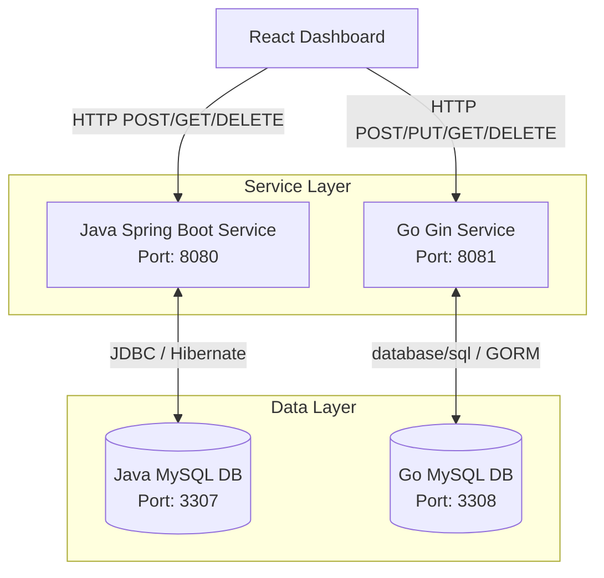
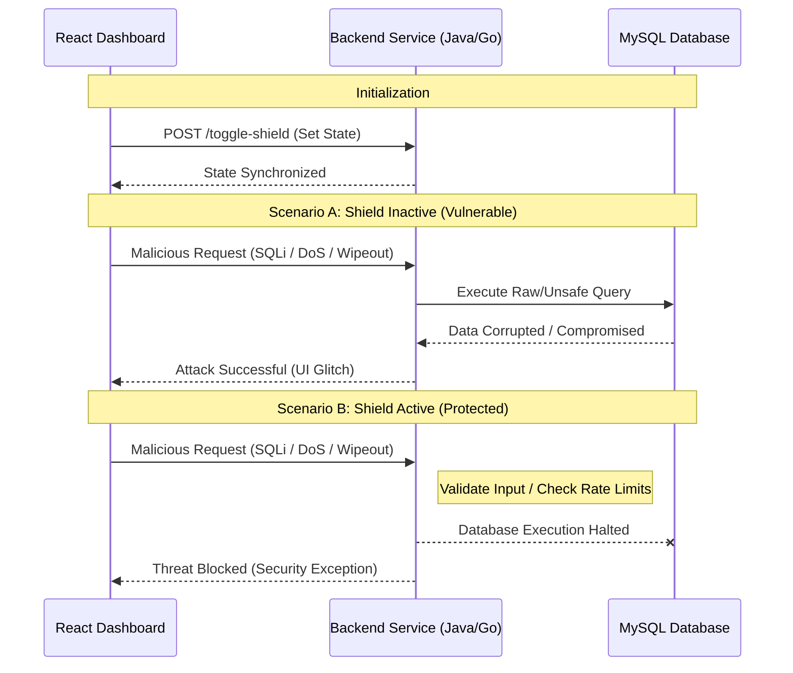

<div align="center">

# Polyglot Threat Visualizer
**A Multi-Stack Cyber Range for Real-Time Vulnerability and Defense Visualization**


</div>

---

## Executive Summary

The Polyglot Threat Visualizer is a containerized monorepo designed to demonstrate critical database vulnerabilities and their respective mitigations in real-time. By implementing vulnerable endpoints alongside secure, industry-standard alternatives, this project provides a tangible environment for security education, testing, and architectural review.

---

## System Architecture

The architecture consists of a React frontend interfacing with two distinct backend microservices (Java and Go), both of which interact with a shared relational database. 



---

## The Threat Landscape

The system explicitly contrasts insecure implementations with secure paradigms. The defenses are activated globally via the application's internal state mechanism.

| Technology Stack | Demonstrated Vulnerability | Applied Defense Paradigm |
| :--- | :--- | :--- |
| **Java Spring Boot** | **SQL Injection (SQLi)** (Raw String Concatenation)<br>**Wipeout** (Unauthenticated `TRUNCATE`) | **Spring Data JPA ORM** (Parameterized Queries)<br>**Role-Based Access Control** (Exception Handling) |
| **Go (Gin + GORM)** | **IDOR** (Insecure Direct Object Reference)<br>**Denial of Service** (Unthrottled Insertion) | **JWT Ownership Validation** (Record Verification)<br>**Idempotency Keys** & Strict **Rate Limiting** |

---

## Attack & Defense Workflows

The application operates in two primary states: **Vulnerable** (Shield Inactive) and **Protected** (Shield Active). The following sequence diagram illustrates the behavioral difference across the system.



---

## Prerequisites & Installation

The entire infrastructure is automated via Docker. To run the environment, ensure you have **Docker** and **Docker Compose** installed.

```bash
# 1. Clone the repository
git clone https://github.com/yourusername/polyglot-threat-visualizer.git

# 2. Navigate to the project directory
cd polyglot-threat-visualizer

# 3. Build and initialize the orchestration
docker compose up --build -d
```

*Note: The two MySQL containers expose ports `3307` (Java) and `3308` (Go) to the host machine to prevent conflicts with pre-existing local database instances. Robust health checks guarantee that backends only spin up once their respective databases are fully initialized.*

---

## Demonstration Guide

To evaluate the system's capabilities, follow this structured walkthrough:

1. **Access the Interface:** Navigate to `http://localhost:3000` to load the Threat Visualizer dashboard.
2. **Manage Data:** Utilize the **Add Data** and **Clear Data** utility buttons under each table to populate or wipe the independent databases cleanly via safe ORM/GORM methods.
3. **Execute Attacks (Vulnerable State):** Initiate an attack by clicking any of the **Launch Attack** actions. The dashboard automatically injects randomized, dynamic payloads resulting in live data defacement, mass duplication bursts, or IDOR corruption. Observe the resulting data corruption and visual feedback (shaking/glitching animations) updating in real-time.
4. **Engage Defenses:** Press the hidden keybind `Alt + X`. This keystroke broadcasts a state-change request to both backends, instantly engaging the security protocols.
5. **Verify Mitigations (Protected State):** Repeat the previously successful attacks. The backends will intercept the payloads, safely reject the requests (throwing `SecurityException`s or `403`s), and the dashboard will display a "Threat Blocked" notification, confirming system integrity without executing raw SQL.

---

## Database Verification

If you want to manually inspect the corrupted (or secured) records during the demonstration, you can shell directly into the running MySQL containers:

```bash
# Access the Java MySQL CLI
docker exec -it mysql-java mysql -u root -p

# Access the Go MySQL CLI
docker exec -it mysql-go mysql -u root -p
```
*(When prompted, enter the password defined in your `.env` file (`JAVA_DB_PASSWORD` or `GO_DB_PASSWORD`). Once inside, you can run `USE java_threat_db;` or `USE go_threat_db;` followed by `SELECT * FROM user_data;` to view the raw records).*

---

## Conclusion & Educational Value

The **Polyglot Threat Visualizer** serves as a practical, hands-on tool for understanding the duality of application security. By contrasting vulnerable code execution with secure architectural patterns across multiple programming languages, it bridges the gap between theoretical security concepts and real-world engineering.

*Built for demonstration, education, and architectural reference.*
